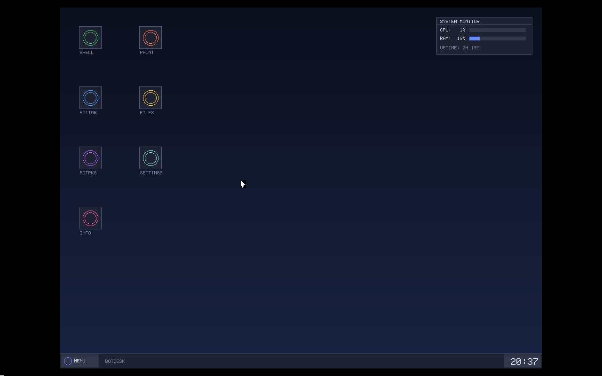
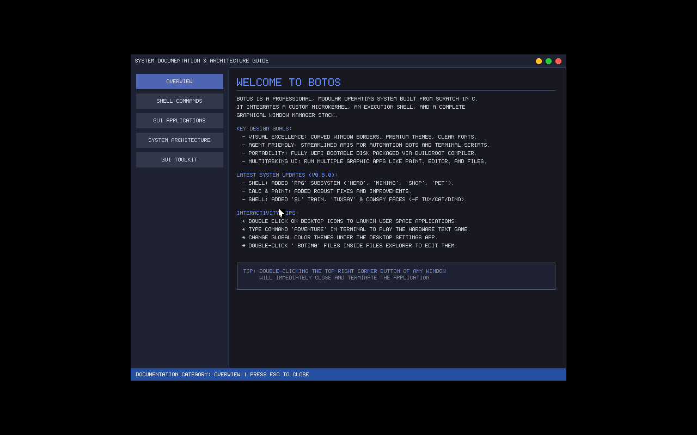
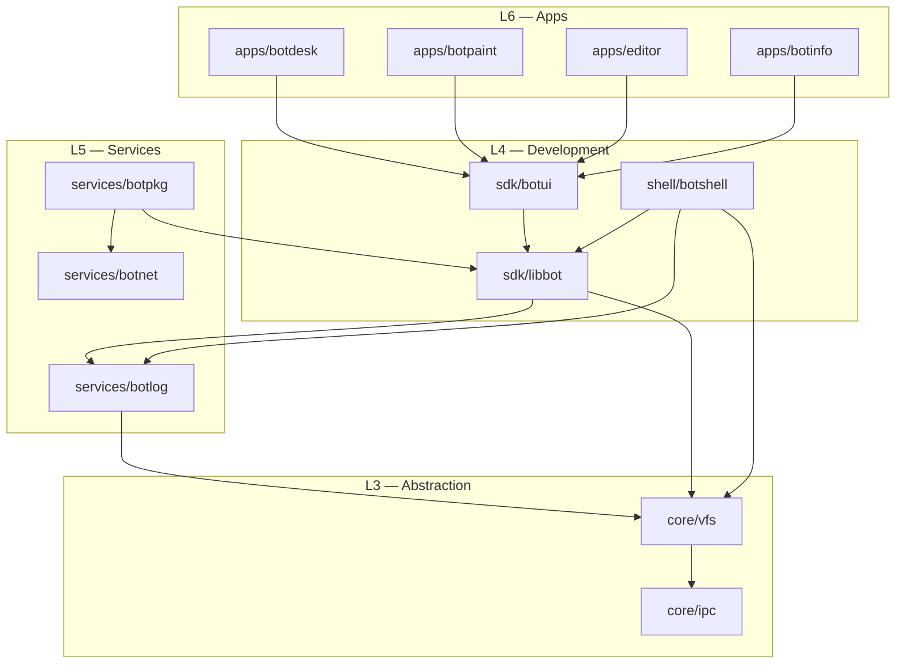

# 🖥️ BotOS Core — Premium Developer-First Operating System Platform


A highly responsive, custom 64-bit Linux-based operating system developer platform built from scratch. BotOS Core integrates a custom micro-window manager desktop environment (`BotDesk`), dynamic terminal command utilities, a high-fidelity SDK (`BotUI`), and the advanced C-to-Python runtime integration bridge (`PyBridge`).

---

## 📸 Visual Previews

<p align="center">
  
  <br>
  <em>(The visual system documentation application (BotInfo) rendering detailed GUI layouts, command help structures, and API guidelines in a responsive dual-column layout)</em>
</p>

<p align="center">
  
  <br>
  <em>(The Pixel Paint Application launched with exact canvas dimension boundaries via automatic file redirection and mime type associations)</em>
</p>

---

## 🌟 Key Features

*   **⚡ PyBridge (C-to-Python Bridge):** Execute Python scripts and statements dynamically from the shell REPL using the `!` prefix. Integrates inline evaluation context, persistent variable states, and tab-completion.
*   **🎮 Terminal RPG Subsystem:** Play a text-based ASCII dungeon escape and character manager. Includes daily quests (`mining` to earn Gold/XP with cooldowns), equipment inventory sheet rendering (`hero` command drawing items), custom pets (`rpg pet adopt/feed/play`), and a skill-tree progression framework.
*   **🎨 Premium GUI Desktop (`BotDesk`):** A custom desktop window manager supporting overlapping window drag-and-drop actions, window resize operations, focus layering, and double-clicking close interfaces.
*   **🖌️ Pixel Art Editor (`Paint`):** Draw shapes and fill blocks. Exports canvas vectors to `BOTIMG_ASCII` format. Associated with visual file manager actions to auto-launch and load pictures.
*   **📂 Visual File Browser (`Files`):** Double-click directories to navigate, `.txt` or `.bot` files to edit, `.botimg` files to draw, and run scripts directly as batch commands.
*   **⚙️ Settings Panel:** Change global theme aesthetics (Dark, Light, Cyberpunk, Forest, Ocean) instantly and adjust cursor speed variables.
*   **📦 Visual Package Manager (`BotPkg`):** Install or uninstall system tools from local and remote package repositories dynamically.
*   **🖥️ Shell Animations & Utilities:** Interactive live performance `dashboard` widget, Matrix digital rain screensaver, animated Steam Locomotive (`sl`) train simulator, dynamic speech bubble cowsay/tuxsay, and CLI calculator.

---

## 🧱 Layered Architecture

BotOS Core follows a strict 6-layer abstraction hierarchy:

```
┌─────────────────────────────────────────────────────┐
│  L6  User Interface Layer                           │
│       BotDesk (WM) · Paint · Editor · BotInfo        │
├─────────────────────────────────────────────────────┤
│  L5  Platform Services                              │
│       BotPkg · BotLog · BotNet                      │
├─────────────────────────────────────────────────────┤
│  L4  Development Layer                              │
│       BotSDK (libbot + BotUI) · BotShell            │
│       PyBridge Engine · Python Runtime              │
├─────────────────────────────────────────────────────┤
│  L3  Abstraction Layer                              │
│       Virtual File System (VFS) · IPC               │
├─────────────────────────────────────────────────────┤
│  L2  Core Kernel                                    │
│       Linux Kernel (LTS) · Init Daemon · GRUB       │
├─────────────────────────────────────────────────────┤
│  L1  Hardware / VM                                  │
│       x86_64 CPU · VirtualBox / QEMU                │
└─────────────────────────────────────────────────────┘
```

### Component Dependency Graph



---

## 🛠️ Getting Started

### Prerequisites
- Linux host or WSL2 on Windows (Ubuntu 22.04+ recommended)
- GCC 12+ or Clang 15+
- CMake 3.20+
- Python 3.10+
- QEMU or VirtualBox (for VM testing)

### Build (Development)
```bash
# Sync and build all native binaries on WSL/Linux
./scripts/build.sh

# Or manual compilation:
mkdir -p build && cd build
cmake .. -DBOTOS_BUILD_TESTS=ON -DBOTOS_BUILD_APPS=ON -DBOTOS_ENABLE_PYBRIDGE=ON
make -j$(nproc)
```

### Run inside QEMU (Direct Console/Interface)
```bash
./scripts/run_qemu.sh
```

### Run inside VirtualBox (Headless/GUI)
```bash
# Convert generated raw disk image to VDI format
wsl bash /mnt/d/OS/scripts/build_disk.sh
& "C:\Program Files\Oracle\VirtualBox\VBoxManage.exe" convertfromraw d:\OS\scratch\disk.img d:\OS\scratch\disk.vdi --format VDI

# Start VM in VirtualBox
./scripts/run_vbox.sh
```

---

## 📈 System Roadmap

| Phase | Milestone | Status |
| :---: | :--- | :---: |
| **1** | Core Boot & Kernel Architecture | ✅ Complete |
| **2** | BotShell Command REPL | ✅ Complete |
| **3** | VFS, RAMfs, & Pipeline Integration | ✅ Complete |
| **4** | PyBridge Subsystem & Python Runtime | ✅ Complete |
| **5** | BotSDK, BotUI Toolkit & BotPkg Manager | ✅ Complete |
| **6** | BotDesk GUI, Settings & Graphical Ecosystem | ✅ Complete |

---

## ⚙️ Engineering Stack

| Domain | Technology |
| :--- | :--- |
| **Core Systems** | C11 (VFS, IPC Scheduler, Kernel Drivers) |
| **Automation** | Python 3 (PyBridge engine runtime interpreter) |
| **Graphics** | Framebuffer, X11 / X.org, SDL2, BotUI SDK |
| **Boot System** | EDK II (UEFI), Custom Themed GRUB |
| **Distribution** | Buildroot GCC Toolchain, CMake |

---

## ⚖️ License

This project is licensed under the MIT License. See [LICENSE](LICENSE) for details.

---

<p align="center">
  <strong>BotOS Core</strong> — Developed by <em>Berk Elmalı</em><br>
</p>
